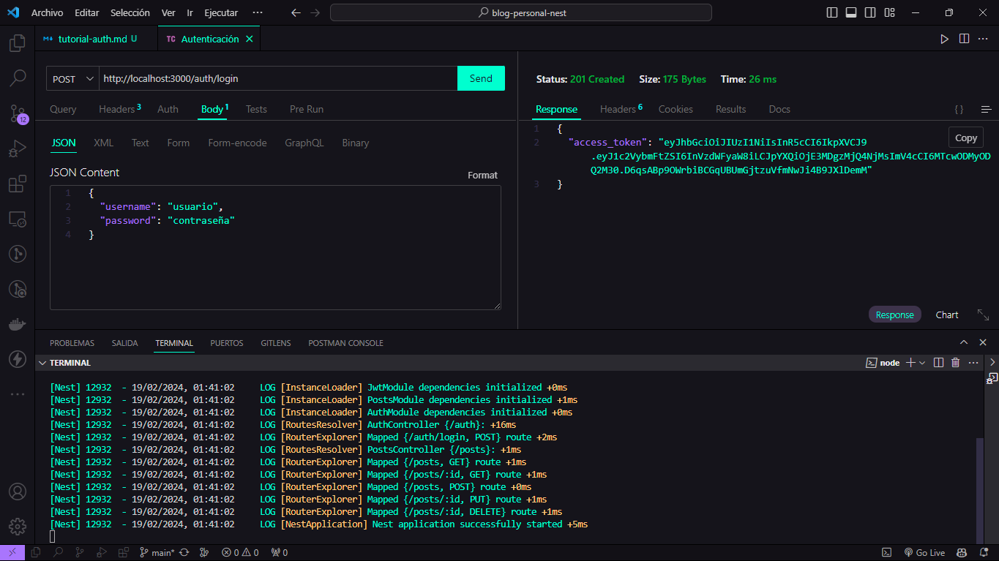

# Blog Personal Nest

Este es un proyecto de blog personal desarrollado con NestJS.

## Sugerencia

¡Antes de clonar o realizar un fork de este repositorio, te animamos a que intentes crear el proyecto desde cero siguiendo el tutorial!

## Tutorial

Si deseas aprender a implementar autenticación en un blog personal con NestJS, te invitamos a seguir el tutorial en el siguiente enlace: 
 

- [**Tutorial:** Implementación de un Blog Personal con Nest.js](/Tutoriales/tutorial.md)

- [**Tutorial:** Implementación de Autenticación en un Blog Personal con Nest.js](/Tutoriales/tutorial-auth.md)

- [**Tutorial:** Implementación de Docker y Docker Compose en un Blog Personal con Nest.js](/Tutoriales/tutorial-docker.md)

- [**Tutorial:** Implementación de MongoDB en un Blog Personal con Nest.js](/Tutoriales/tutorial-connection-database.md)

- [**Tutorial:** Implementación de Peticiones Get, Post, Put, Delete](/Tutoriales/tutorial-peticiones.md)

- [**Tutorial:** Desarrollo de Endpoints RESTful en Nest.js](/Tutoriales/tutorial-restful.md)

<!-- - [**Tutorial:** Implementación de Pruebas Unitarias en un Blog Personal con Nest.js](/Tutoriales/tutorial-pruebas.md) -->

## Descripción

 Este proyecto es un blog personal desarrollado utilizando el framework NestJS. Permite a los usuarios realizar operaciones CRUD (Crear, Leer, Actualizar y Eliminar) en publicaciones. La aplicación sigue una arquitectura modular y está diseñada siguiendo los principios de una API RESTful. 

## Funcionalidades

- Crear una nueva publicación
- Leer una publicación existente
- Actualizar una publicación existente
- Eliminar una publicación existente

## Tecnologías utilizadas

- NestJS
- TypeScript
- UUID
- Docker
- Docker Compose
- MongoDB

## Instalación

- Clona este repositorio: git clone `https://github.com/statick88/blogpersonalnest`
- Instala las dependencias: npm install

## Uso

- Inicia el servidor de desarrollo utilizando docker desktop: `docker compose up -d`
- Realiza las peticiones HTTP utilizando tu herramienta favorita como Thunder Client.

## Endpoints

- GET /posts: Obtener todas las publicaciones
- GET /posts/:id: Obtener una publicación por su ID
- POST /posts: Crear una nueva publicación
- PUT /posts/:id: Actualizar una publicación existente
- DELETE /posts/:id: Eliminar una publicación existente

<!-- ## Autenticación

Para proteger las rutas y los recursos, se ha implementado la autenticación mediante tokens JWT (JSON Web Tokens). 

Debes obtener un token de acceso enviando una solicitud POST a `/auth/login` con las credenciales de usuario. Luego, incluye este token en la cabecera Authorization de tus solicitudes HTTP utilizando el esquema Bearer. -->

## Mejoras Futuras

- [✅] Implementación de autenticación y autorización.
- [✅] Implementación de Docker y Docker Compose.
- [✅] Implementación de MongoDB para almacenar las publicaciones.
- [✅] Implementación de peticiones GET, POST, PUT, DELETE.
- [❌] Implementación de comentarios en las publicaciones.
- [❌] Mejorar la validación de datos en las solicitudes POST y PUT.
- [❌] Implementación de pruebas unitarias y de integración.
- [❌] Implementación de un front-end utilizando Angular, React o Vue.js.

## Contribuyendo

¡Las contribuciones son bienvenidas! Si tienes alguna sugerencia, mejora o corrección, por favor crea un pull request.

## Licencia

[MIT](LICENSE)